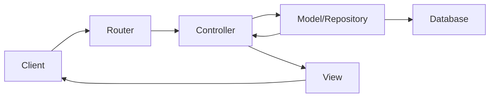

# Architecture MVC de MediaBox

## Vue d'ensemble

MediaBox utilise une architecture MVC (Modèle-Vue-Contrôleur) multicouches pour organiser son code de manière modulaire et maintenable.

```
MediaBox/
├── Models/          # Couche Modèle - Gestion des données
├── Views/           # Couche Vue - Interface utilisateur
├── Controllers/     # Couche Contrôleur - Logique métier
├── Fonctions/       # Utilitaires et services partagés
└── Ressources/      # Assets statiques
```

## 1. Couche Modèle

### Rôle
- Gestion des données et de la logique métier
- Interaction avec la base de données
- Validation des données

### Classes principales
- `AbstractModel` : Classe de base pour tous les modèles
- `Audio`, `Video`, `Photo`, `Text` : Modèles spécifiques
- `Manager` : Gestionnaire de base de données
- `AudioRepository`, etc. : Couche d'abstraction pour l'accès aux données

### Exemple de flux
```php
// Dans AudioRepository
public function findAllByUser(int $userId): array {
    $connection = $this->manager->getConnexion();
    $query = "SELECT * FROM audio WHERE user_id = :user_id";
    // ...
}
```

## 2. Couche Vue

### Rôle
- Présentation des données
- Interface utilisateur
- Templates HTML

### Structure
- `Views/main/` : Templates principaux
- `Views/connect/` : Pages de connexion
- `Views/admin/` : Interface d'administration
- `base.html.php` : Layout principal

### Exemple de template
```php
// Dans audio.php
<div id="player-container">
    <div class="player-audio">
        <div class="track-art"></div>
        <div class="track-name"><?php echo $title; ?></div>
    </div>
</div>
```

## 3. Couche Contrôleur

### Rôle
- Gestion des requêtes
- Coordination Modèle-Vue
- Logique de navigation
- Validation des entrées

### Classes principales
- `BaseController` : Contrôleur abstrait de base
- `AudioController`, `VideoController`, etc. : Contrôleurs spécifiques
- `Router` : Routage des requêtes

### Exemple de flux
```php
// Dans AudioController
public function list() {
    $this->checkAuth();
    $audios = $this->audioRepository->findAllByUser($userId);
    generate("Views/main/audioList.php", ['audios' => $audios]);
}
```

## 4. Services Partagés

### SessionManager
- Gestion des sessions
- Sécurité (CSRF, authentification)
- État utilisateur

### Validator
- Validation des données
- Règles de validation
- Messages d'erreur

### RoleManager
- Gestion des rôles
- Autorisations
- Contrôle d'accès

## 5. Flux de données



## 6. Sécurité

### Implémentation
- Validation des entrées
- Protection CSRF
- Sessions sécurisées
- Échappement des sorties
- Requêtes préparées

### Exemple
```php
// Dans BaseController
protected function checkAuth() {
    if (!$this->session->isAuthenticated()) {
        $this->redirect('connexion/index');
    }
}
```

## 7. Bonnes pratiques

### Organisation du code
- Un contrôleur par type de média
- Séparation claire des responsabilités
- Interfaces pour les contrats
- Repositories pour l'accès aux données

### Conventions
- PSR-4 pour l'autoloading
- Nommage cohérent des classes
- Documentation PHPDoc
- Gestion des erreurs centralisée

## Conclusion

Cette architecture MVC multicouches permet à MediaBox de :
- Séparer les responsabilités
- Faciliter la maintenance
- Améliorer la testabilité
- Sécuriser l'application
- Supporter l'évolution future
