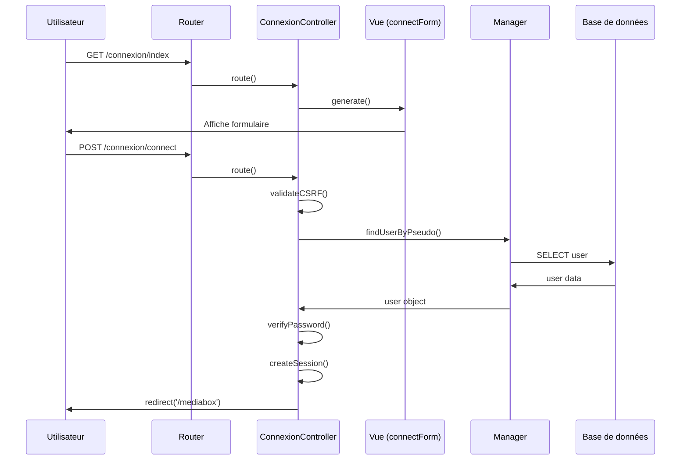

# Architecture MVC - Processus de Connexion MediaBox

## 1. Vue (View)

### 1.1 Composants
`Views/connect/connectForm.php`
- Formulaire de connexion HTML/PHP
- Intégration des styles CSS
- Gestion des messages d'erreur/succès
- Validation côté client JavaScript
- Token CSRF intégré

### 1.2 Responsabilités
- Affichage du formulaire de connexion
- Présentation des messages d'erreur
- Validation instantanée des champs
- Gestion de l'expérience utilisateur
- Accessibilité et responsive design

## 2. Contrôleur (Controller)

### 2.1 Composants
`Controllers/ConnexionController.php`
- Classe principale de gestion de connexion
- Méthodes index() et connect()
- Validation des données
- Gestion des sessions
- Redirection selon le statut

### 2.2 Responsabilités
- Réception des requêtes HTTP
- Validation des données POST
- Vérification du token CSRF
- Gestion de l'état de session
- Coordination Vue/Modèle

## 3. Modèle (Model)

### 3.1 Composants
`Models/Manager.php` et `Models/Bdd.php`
- Connexion base de données
- Requêtes préparées
- Validation des credentials
- Gestion des erreurs
- Transactions sécurisées

### 3.2 Responsabilités
- Interaction avec la base de données
- Validation des identifiants
- Hachage des mots de passe
- Gestion des transactions
- Journalisation des accès

## 4. Flux de Données

### 4.1 Processus de Connexion
1. Utilisateur accède à /connexion/index
2. Router → ConnexionController->index()
3. Contrôleur vérifie session existante
4. Génération vue connectForm.php
5. Utilisateur soumet formulaire
6. Validation données POST
7. Vérification credentials BDD
8. Création/mise à jour session
9. Redirection selon profil

### 4.2 Gestion des Erreurs
- Validation formulaire côté client
- Validation serveur des données
- Messages d'erreur contextuels
- Journalisation des échecs
- Protection contre force brute

## 5. Sécurité

### 5.1 Mesures Implémentées
- Protection CSRF
- Sessions sécurisées
- Mots de passe hachés (bcrypt)
- Requêtes préparées
- Validation stricte des entrées

### 5.2 Bonnes Pratiques
- Timeout de session
- Régénération ID session
- Headers de sécurité
- Audit des connexions
- Rate limiting

## 6. Diagramme de Séquence



## 7. Structure des Fichiers

```
mediabox/
├── Controllers/
│   └── ConnexionController.php
├── Models/
│   ├── Manager.php
│   └── Bdd.php
├── Views/
│   └── connect/
│       └── connectForm.php
└── Fonctions/
    └── SessionManager.php
```

## 8. Points d'Extension

### 8.1 Améliorations Possibles
- Authentification 2FA
- OAuth/OpenID Connect
- Remember me
- Connexion par email
- Captcha après échecs

### 8.2 Maintenance
- Logs centralisés
- Métriques de connexion
- Tests automatisés
- Documentation API
- Monitoring temps réel
