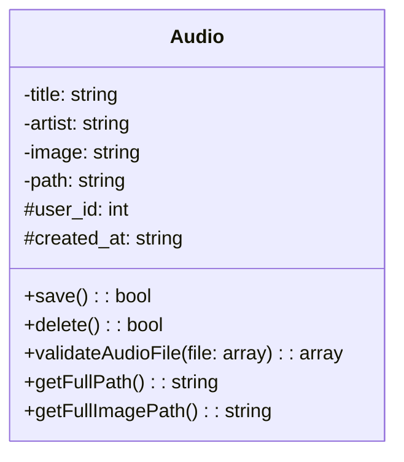

# Diagramme de classe Audio

Ce diagramme représente la classe Audio qui gère les fichiers audio dans l'application MediaBox.

## Attributs

- **title**: Titre de la piste audio
- **artist**: Nom de l'artiste
- **image**: Chemin vers l'image de la pochette
- **path**: Chemin vers le fichier audio
- **user_id**: ID de l'utilisateur propriétaire
- **created_at**: Date de création

## Méthodes

- **save()**: Sauvegarde ou met à jour l'audio dans la base de données
- **delete()**: Supprime l'audio et ses fichiers associés
- **validateAudioFile()**: Valide le format et la taille du fichier audio
- **getFullPath()**: Retourne le chemin complet du fichier audio
- **getFullImagePath()**: Retourne le chemin complet de l'image

## Relations

La classe Audio est liée à la classe User via l'attribut user_id.
