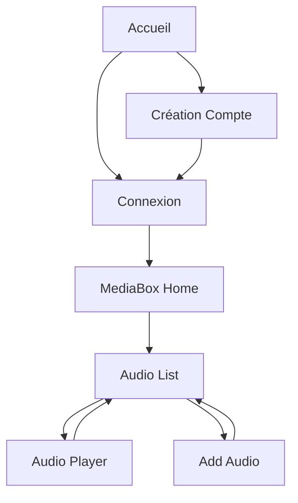

# Wireframe Navigation MediaBox

## 1. Structure des Frames

### Frame "Connexion" (375x812)
```figma
Frame "Connexion"
├── Logo MediaBox (centered, 48x48)
├── Titre "Connexion à votre compte"
├── Form Container
│   ├── Input Username
│   ├── Input Password
│   ├── Button "Connexion"
│   └── Link "Créer un compte"
└── Footer
```

### Frame "Création Compte" (375x812)
```figma
Frame "Création"
├── Logo MediaBox
├── Titre "Création de compte"
├── Form Container
│   ├── Input Email
│   ├── Input Username
│   ├── Input Password
│   ├── Input Confirm Password
│   └── Button "Créer"
└── Footer
```

### Frame "MediaBox Home" (375x812)
```figma
Frame "MediaBox"
├── Header
│   ├── Title "MediaBox"
│   └── Theme Toggle
├── Navigation
│   ├── Home
│   ├── Profile
│   ├── Audio
│   ├── Video
│   ├── Photo
│   └── Text
├── Search Bar
└── Media Grid
    ├── Audio Card
    ├── Video Card
    ├── Photo Card
    └── Text Card
```

### Frame "Audio List" (375x812)
```figma
Frame "Audio"
├── Header
├── Navigation
├── Action Buttons
│   ├── Add Audio
│   ├── Player
│   └── Record
├── Search Bar
└── Audio Grid
    └── Audio Items
        ├── Cover Image
        ├── Title/Artist
        └── Controls
```

### Frame "Audio Player" (375x812)
```figma
Frame "Player"
├── Header
├── Player Container
│   ├── Track Art
│   ├── Track Info
│   │   ├── Title
│   │   └── Artist
│   ├── Controls
│   │   ├── Previous
│   │   ├── Play/Pause
│   │   └── Next
│   └── Progress Bar
└── Action Buttons
```

## 2. Navigation Flow



## 3. Interactions

### Transitions
- Fade entre les vues principales
- Slide pour les menus latéraux
- Scale pour les cartes au hover

### Animations
- Boutons : Scale on hover (0.2s)
- Cards : Shadow on hover
- Player : Smooth progress bar

## 4. Responsive Breakpoints

### Mobile (375x812)
- Navigation : Menu hamburger
- Cards : 1 colonne
- Player : Full width

### Tablet (768x1024)
- Navigation : Menu hamburger
- Cards : 2 colonnes
- Player : 80% width

### Desktop (1440x900)
- Navigation : Full menu
- Cards : 4 colonnes
- Player : 60% width
