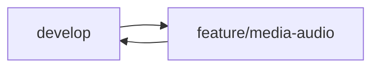

# Organisation du Versioning Git - MediaBox

## Structure des Branches

### Branches Principales
- `main` : Production stable de MediaBox
- `develop` : Développement principal et intégration des fonctionnalités
- `staging` : Tests de pré-production et validation utilisateur

### Branches Fonctionnelles
- `feature/media-*` : Nouvelles fonctionnalités médias (ex: feature/media-audio-player)
- `feature/ui-*` : Améliorations interface (ex: feature/ui-dark-theme)
- `feature/security-*` : Fonctionnalités sécurité (ex: feature/security-auth)
- `bugfix/*` : Corrections de bugs spécifiques
- `hotfix/*` : Corrections urgentes en production
- `release/*` : Préparation des versions

## Workflow par Module

### 1. Module Audio

- Branches dédiées pour :
  * Lecteur audio (feature/media-audio-player)
  * Gestion playlists (feature/media-audio-playlist)
  * Upload fichiers (feature/media-audio-upload)
  * Métadonnées (feature/media-audio-metadata)

### 2. Module Vidéo
- Branches pour :
  * Lecteur vidéo (feature/media-video-player)
  * Gestion miniatures (feature/media-video-thumbnails)
  * Encodage (feature/media-video-encoding)

### 3. Module Photo
- Branches pour :
  * Galerie photos (feature/media-photo-gallery)
  * Édition images (feature/media-photo-edit)
  * Albums (feature/media-photo-albums)

### 4. Module Texte
- Branches pour :
  * Éditeur texte (feature/media-text-editor)
  * Catégorisation (feature/media-text-categories)
  * Recherche (feature/media-text-search)

## Conventions de Commits

### Format
```
type(scope): description

- feat(audio): Ajout du support des playlists
- fix(security): Correction faille XSS dans l'upload
- style(ui): Mise à jour thème sombre
- docs(api): Documentation endpoints médias
```

### Types Spécifiques MediaBox
- `feat(media)`: Nouvelles fonctionnalités médias
- `feat(ui)`: Améliorations interface
- `feat(security)`: Fonctionnalités sécurité
- `fix(media)`: Corrections bugs médias
- `fix(security)`: Corrections sécurité
- `style(ui)`: Modifications CSS/design
- `docs(api)`: Documentation API
- `test(media)`: Tests fonctionnels médias

## Environnements

### Développement (Local)
- Base de données : MySQL dev locale
- Stockage médias : Dossier local /Ressources
- Configuration debug activée
- Variables d'environnement dev

### Test (Staging)
- Base de données : MySQL test
- Stockage médias : Serveur test dédié
- Tests automatisés activés
- Monitoring des performances

### Production
- Base de données : MySQL prod
- Stockage médias : CDN/Serveur production
- Logs sécurité activés
- Sauvegardes automatiques

## Procédures Spécifiques

### Déploiement Audio/Vidéo
1. Tests encodage médias
2. Vérification des lecteurs
3. Tests performances streaming
4. Validation formats supportés

### Déploiement Photos
1. Tests compression images
2. Vérification miniatures
3. Tests galerie responsive
4. Validation métadonnées

### Sécurité
1. Scan vulnérabilités
2. Tests injection SQL
3. Validation uploads
4. Vérification permissions

## Versioning Sémantique
- MAJOR : Changements architecture médias
- MINOR : Nouvelles fonctionnalités médias
- PATCH : Corrections bugs et optimisations

## Protection des Données
- Sauvegarde base de données quotidienne
- Backup médias hebdomadaire
- Rétention 30 jours
- Chiffrement des sauvegardes
