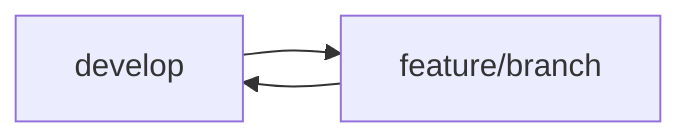
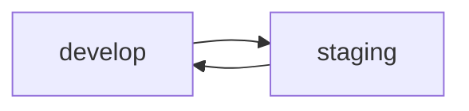
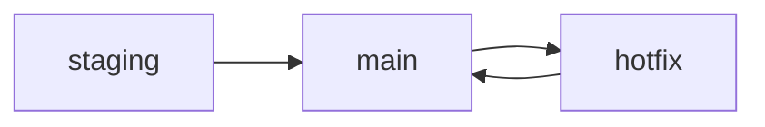

# Organisation du Versioning Git - MediaBox

## Structure des Branches

### Branches Principales
- `main` : Branche de production, code stable et validé
- `develop` : Branche de développement principale
- `staging` : Branche de pré-production pour les tests

### Branches Fonctionnelles
- `feature/*` : Nouvelles fonctionnalités (ex: feature/audio-player)
- `bugfix/*` : Corrections de bugs
- `hotfix/*` : Corrections urgentes en production
- `release/*` : Préparation des versions

## Workflow de Développement

### 1. Développement de Fonctionnalités

1. Création depuis `develop` : `git checkout -b feature/nom-feature`
2. Développement et commits réguliers
3. Tests unitaires et intégration
4. Pull Request vers `develop`

### 2. Phase de Test

1. Merge des features validées dans `staging`
2. Tests automatisés
3. Tests manuels QA
4. Validation fonctionnelle

### 3. Mise en Production

1. Création branche `release/x.y.z`
2. Tests finaux et documentation
3. Merge dans `main` et tag version
4. Hotfix si nécessaire

## Conventions

### Commits
- Format : `type(scope): description`
- Types : feat, fix, docs, style, refactor, test, chore
- Message clair et descriptif

### Versioning
- Semantic Versioning (MAJOR.MINOR.PATCH)
- Tags pour chaque release
- Changelog maintenu à jour

### Protection des Branches
- `main` : Push direct interdit
- `develop` : Pull Request obligatoire
- `staging` : Tests automatisés requis

## Environnements

### Local (Développement)
- Branche : feature/* ou develop
- Base de données de dev
- Configuration de debug

### Test
- Branche : staging
- Base de données de test
- Tests automatisés

### Production
- Branche : main
- Base de données production
- Monitoring et logs

## Procédures

### Merge Request
1. Code review obligatoire
2. Tests passants
3. Documentation à jour
4. Conflits résolus

### Hotfix
1. Branche depuis main
2. Correction rapide
3. Tests critiques
4. Merge dans main ET develop

### Release
1. Gel des fonctionnalités
2. Tests complets
3. Documentation finale
4. Tag et merge
